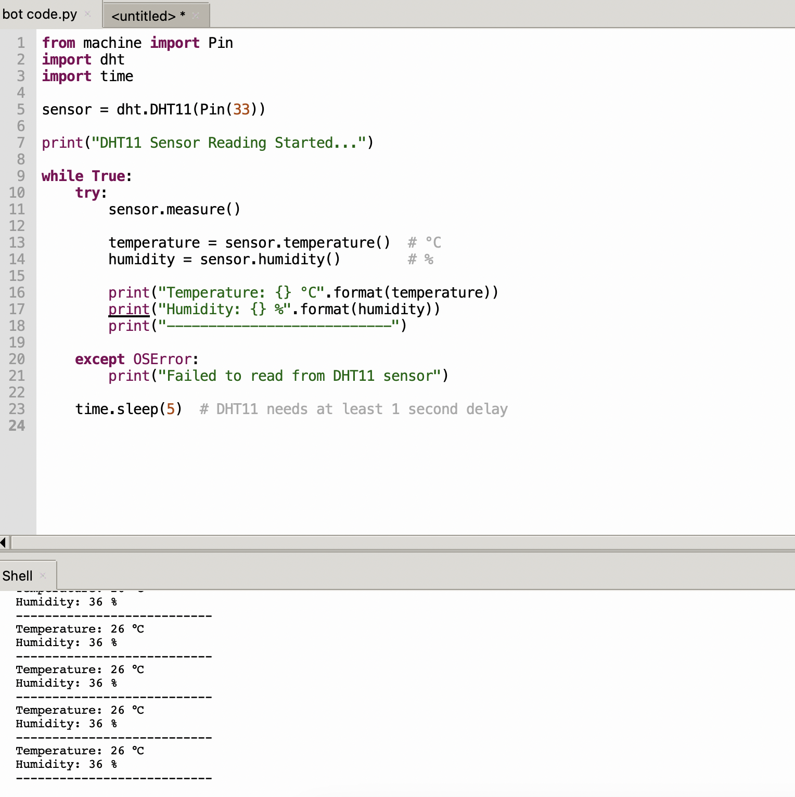
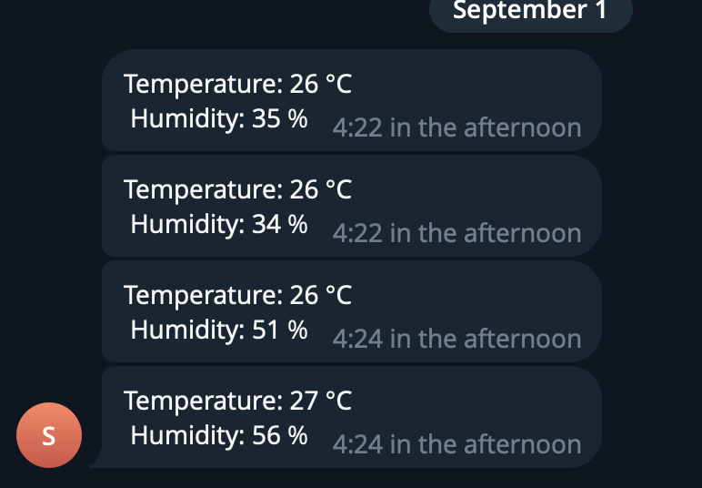
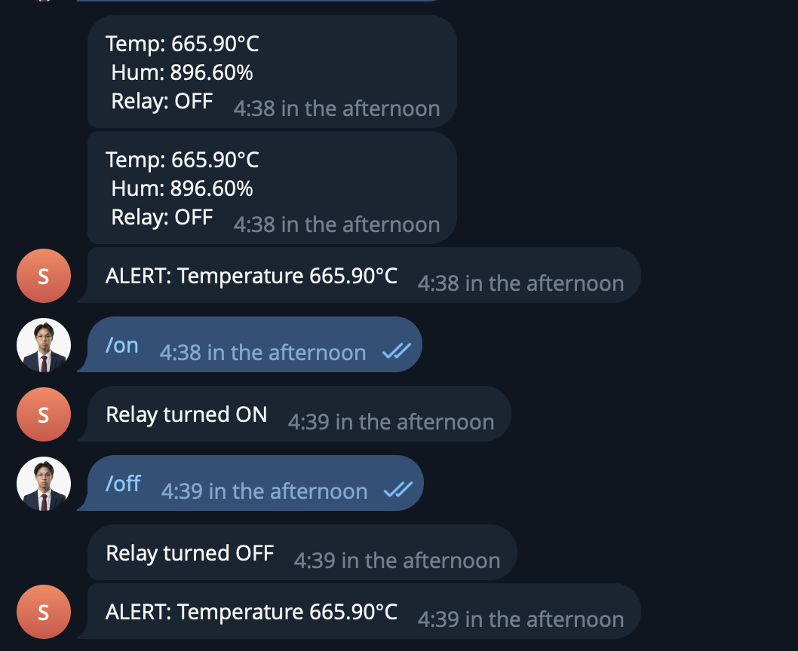
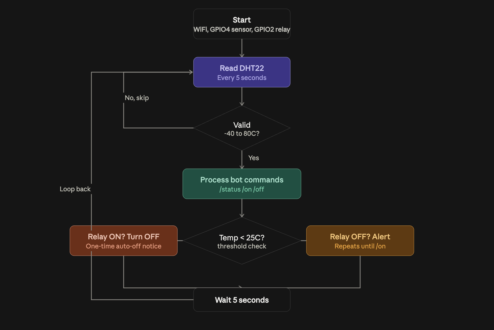

# Lab 1 - Temperature Sensor With Relay Control (Telegram)

## Overview
In this lab, you will build a tiny IoT monitoring node with an ESP32, DHT22
temperature/humidity sensor, and a relay. The ESP32 sends Telegram alerts when the
temperature rises above a threshold and lets users control the relay via chat commands. Once the
temperature drops below the threshold again, the relay turns off automatically.

## Activity Objective
• Design & implement an IoT system using ESP32 + MicroPython (sensing, actuation,
networking).
• Apply programming techniques for periodic sampling, debouncing, and simple state
machines.
• Develop a chat-based remote control application using Telegram Bot API (HTTP
requests).
• Document & present system design, wiring, and test evidence (screenshots/video), and
reflect on reliability/ethics.
• Evaluate performance (sampling interval, rate limits) and safety (relay loads, power
isolation)

## Equipment
• ESP32 Dev Board (MicroPython firmware flashed)
• DHT11 sensor
• Relay module
• jumper wires
• USB cable + laptop with Thonny
• Wi-Fi access (internet)

## Wiring
This is the diagram for wiring setup with the available equipments.

## Usage
1. Setup the correct wire and upload the code to Thonny.
2. Open the serial monitor at the configured baud rate.
3. Verify sensor readings every 5 seconds.
4. In Telegram, send commands to the bot:
   - `/status` -> returns temperature, humidity, and relay state
   - `/on` -> turns relay ON
   - `/off` -> turns relay OFF

Bot token "8968694049:AAGn5cIzMF-EH8ngKmNaHyU-a46SznCzqn4"

## Task 1 - Temp and humidity

Read DHT11 every 5 seconds and print the temperature and humidity with 2 decinmals.

## Task 2 - Telegram send

Implement send_message() and post a test message to your group.

Task 2 Telegram output

## Task 3 - Bot Command

Implement /status to reply with current T/H and relay state.
Implement /on and /off to control the relay.
Bot Command Relay

## Task 4 DEMO VIDEO 

No messages while T < 25 C.

If T >= 25 C and relay is OFF, send an alert every loop (5 s) until /on is received.

After /on, stop alerts. When T < 25 C, turn relay OFF automatically and send a one-time "auto-OFF" notice.

[DEMO VIDEO](https://youtube.com/shorts/gEKEVXU1BuM)

## Task 5 Flowchart

