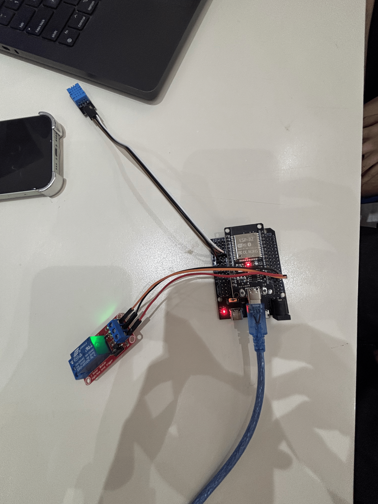
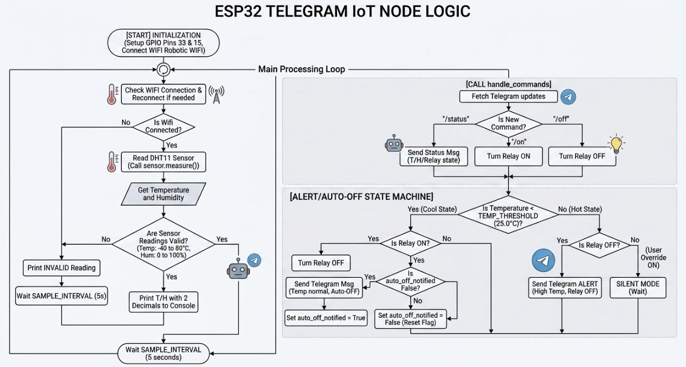

# Lab 1 - Temperature Sensor With Relay Control (Telegram)

## Overview
In this lab, you will build a tiny IoT monitoring node with an ESP32, DHT22 temperature/humidity sensor, and a relay. The ESP32 sends Telegram alerts when the temperature rises above a threshold and lets users control the relay via chat commands. Once the temperature drops below the threshold again, the relay turns off automatically.

## Activity Objective
- Design and implement an IoT system using ESP32 + MicroPython (sensing, actuation, networking).
- Apply programming techniques for periodic sampling, debouncing, and simple state machines.
- Develop a chat-based remote control application using Telegram Bot API (HTTP requests).
- Document and present system design, wiring, and test evidence (screenshots/video), and reflect on reliability/ethics.
- Evaluate performance (sampling interval, rate limits) and safety (relay loads, power isolation).

## Hardware
- Microcontroller with Wi-Fi ESP32, Exstension Board
- DHT22 temperature/humidity sensor
- Relay module
- Jumper wires, breadboard

## Equipment
- ESP32 dev board 
- DHT22 sensor
- Relay module
- Jumper wires
- USB cable + laptop with Thonny
- Wi-Fi access (internet)
- Telegram Bot Token

## Wiring
This is the diagram for wiring setup with the available equipments.

## Usage
1. Setup the correct wire and upload the code to Thonny.
2. Open the serial monitor at the configured baud rate.
3. Verify sensor readings every 5 seconds.
4. In Telegram, send commands to the bot:
   - `/status` -> returns temperature, humidity, and relay state
   - `/on` -> turns relay ON
   - `/off` -> turns relay OFF

Bot token "8968694049:AAGn5cIzMF-EH8ngKmNaHyU-a46SznCzqn4"

## Flowchart

## DEMO VIDEO

[DEMO VIDEO](https://youtube.com/shorts/gEKEVXU1BuM)
