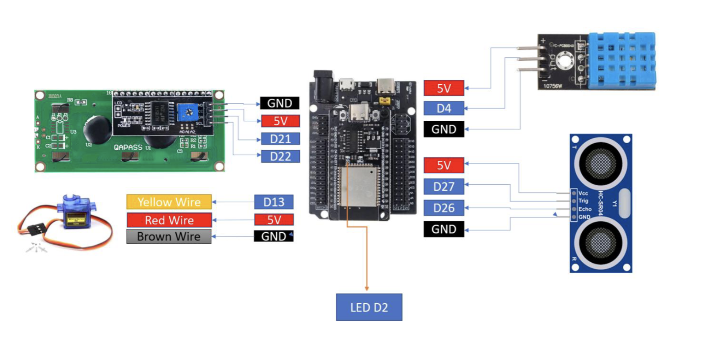
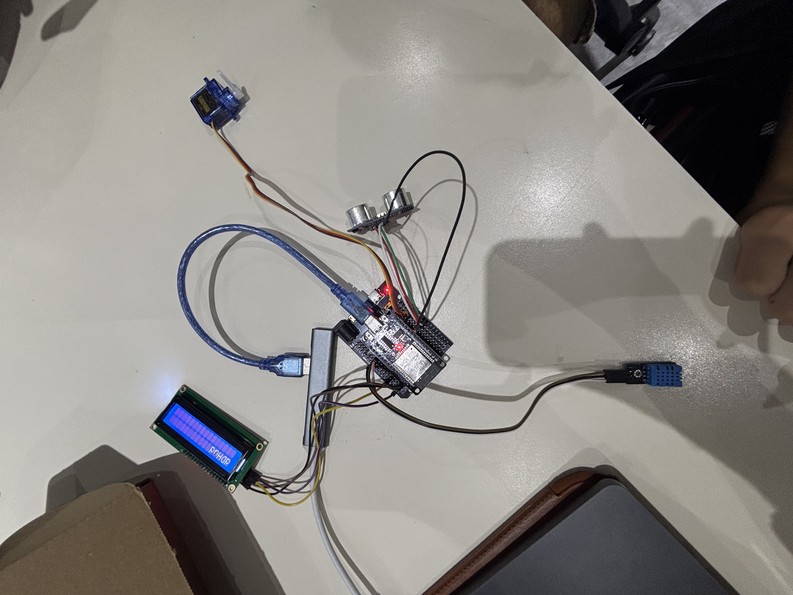
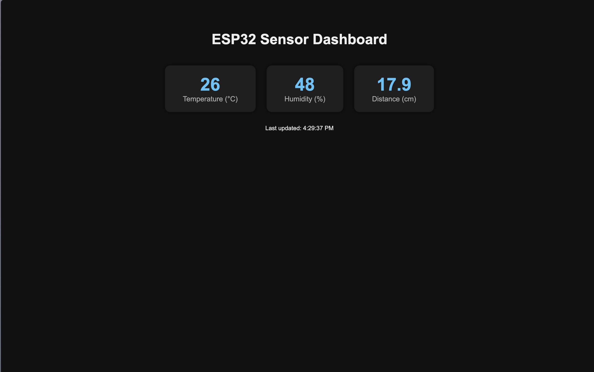
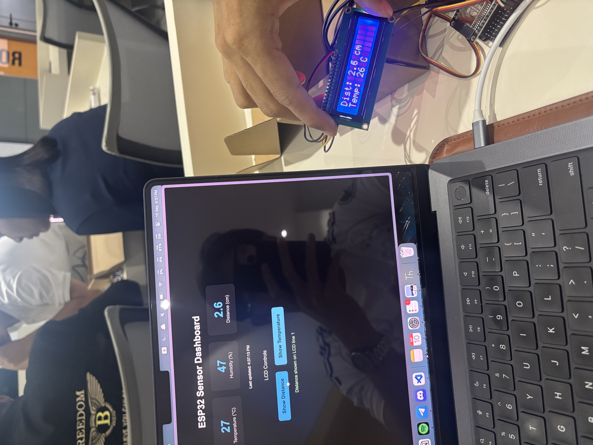

# LAB2: IoT Webserver with LED, Sensors, LCD, and Servo Control

## Group Members

- Andy Eang

- Ngeabheng Chan

- Sereyvattanac Na


## 1. Overview

In this lab, students will design an ESP32-based IoT system with MicroPython that integrates a
web interface, sensors, an LCD display, and a servo motor. The system will allow users to control
an LED and servo, read sensors, and send custom messages to the LCD through a webserver.
This lab emphasizes interaction between a web user interface and physical hardware, giving
students practice in event-driven IoT design.

## 2. Learning Outcomes (CLO Alignment)

By the end of this lab, students will be able to:

- Implement a MicroPython webserver to serve HTML controls.
- Control an LED from the web page.
- Read data from DHT11 and ultrasonic sensors and expose it on the webserver.
- Use web buttons to selectively show temperature and distance on an LCD (I2C).
- Control a servo motor through a web slider and display its angle on the LCD.
- Send custom text from a textbox to display on the LCD.
- Document wiring, interface behavior, and system operation.

## 3. Equipment

- ESP32 Dev Board (MicroPython firmware flashed)
- DHT11 sensor (temperature/humidity)
- HC-SR04 ultrasonic distance sensor
- LCD 16x2 with I2C backpack
- SG90 servo motor
- Breadboard and jumper wires
- USB cable and laptop with Thonny
- Wi-Fi access

## 4. Wiring





### Pin Connections

| Component        | ESP32 Pin | Description                                  |
| ----------------- | --------- | --------------------------------------------- |
| LED               | GPIO2     | Built-in LED (or external LED with resistor) |
| DHT11 Data        | GPIO4     | Temperature/Humidity sensor data pin         |
| HC-SR04 Trigger   | GPIO27    | Ultrasonic sensor trigger pin                |
| HC-SR04 Echo      | GPIO26    | Ultrasonic sensor echo pin                   |
| LCD SDA           | GPIO21    | I²C data line (default SDA)                  |
| LCD SCL           | GPIO22    | I²C clock line (default SCL)                 |
| LCD VCC           | 5V        | Power supply for LCD                         |
| LCD GND           | GND       | Ground                                        |
| Servo Signal      | GPIO13    | SG90 yellow signal wire                      |
| Servo VCC         | 5V        | SG90 red wire                                |
| Servo GND         | GND       | SG90 brown wire                              |
| Sensors VCC       | 3.3V/5V   | Power supply for sensors                     |
| Sensors GND       | GND       | Ground                                        |

### Configuration

```python
# Wi-Fi Configuration
WIFI_SSID = "YOUR_SSID"
WIFI_PASS = "YOUR_PASSWORD"

# Pin Configuration
LED_PIN = 2
DHT_PIN = 4
TRIG_PIN = 27
ECHO_PIN = 26
I2C_SDA = 21
I2C_SCL = 22
LCD_ADDR = 0x27
SERVO_PIN = 13
```

### Setup Instructions

1. Flash MicroPython firmware to ESP32 (if not already done).
2. Wire all components according to the wiring diagram above.
3. Download the required LCD library files (if not already in your project):
   - `lcd_api.py` — LCD API helper library
   - `machine_i2c_lcd.py` — I²C LCD driver for ESP32
   - These files can be found in MicroPython LCD I²C libraries online
4. Update the configuration in `main.py` with your Wi-Fi credentials.
5. Upload all files to ESP32 using Thonny:
   - `main.py`
   - `lcd_api.py`
   - `machine_i2c_lcd.py`
6. Reset the ESP32 or run `main.py`.
7. Check the serial monitor for the ESP32's IP address.
8. Open a web browser and navigate to `http://<ESP32_IP_ADDRESS>`.

## 5. Tasks and Checkpoints

### Task 1 — Sensor Monitoring (15 pts)

**Objective:**
- Read temperature and humidity from the DHT11 sensor.
- Measure distance using the HC-SR04 ultrasonic sensor.
- Display all sensor values on the web page and refresh them every 1-2 seconds.

**Implementation:**

1. **DHT11 Temperature Sensor** — Connected to GPIO4

   ```python
   dht_sensor = dht.DHT11(Pin(4))
   def read_temp_c():
       dht_sensor.measure()
       return dht_sensor.temperature()
   ```

2. **HC-SR04 Ultrasonic Sensor** — Trigger on GPIO27, Echo on GPIO26

   ```python
   def read_distance_cm():
       trig.value(0)
       time.sleep_us(2)
       trig.value(1)
       time.sleep_us(10)
       trig.value(0)
       duration = time_pulse_us(echo, 1, 30000)
       dist = (duration * 0.0343) / 2
       return round(dist, 2)
   ```

3. **JSON API Endpoint** — `/api` returns sensor data in JSON format:

   ```json
   { "temp": 25, "dist": 12.5 }
   ```

4. **Auto-refresh** — JavaScript polls the API every 2 seconds using `fetch()` and updates the display without a page reload.

**Evidence:** Screenshot showing the sensor readings on the web page.



---

### Task 2 — Sensor Data to LCD (15 pts)

**Objective:**
- Add two buttons to the web page:
  - **Show Distance** — Display the ultrasonic distance on LCD line 1.
  - **Show Temperature** — Display the temperature on LCD line 2.

**Implementation:**

1. **Show Distance Button** — Endpoint: `/lcd/distance`

   ```python
   d = read_distance_cm()
   msg = "Distance: Err" if d is None else ("Distance:%scm" % d)
   lcd_write(0, msg)  # Write to line 0 (first line)
   ```

2. **Show Temp Button** — Endpoint: `/lcd/temp`

   ```python
   t = read_temp_c()
   msg = "Temp: Err" if t is None else ("Temp:%sC" % t)
   lcd_write(1, msg)  # Write to line 1 (second line)
   ```

The `lcd_write()` helper function clears the line and writes the text:

```python
def lcd_write(line, text):
    lcd.move_to(0, line)
    lcd.putstr(" " * 16)  # Clear line
    lcd.move_to(0, line)
    lcd.putstr((text or "")[:16])  # Write text (max 16 chars)
```

**Evidence:** Photo showing the correct sensor values on the LCD.



---

### Task 3 — Web-Controlled Servo (15 pts)

**Objective:**
- Connect an SG90 servo motor to the ESP32.
- Add a slider to the web page with a range from 0 to 180 degrees.
- Moving the slider must change the servo angle.
- Display the selected angle on the web page.

**Implementation:**

> ⚠️ **Not yet documented.** Your current draft doesn't include the servo code, `/servo` endpoint, or slider UI. Add the following once implemented:
> - PWM setup for the SG90 on `SERVO_PIN` (e.g. `machine.PWM`)
> - An HTTP endpoint (e.g. `/servo?angle=...`) that maps 0–180° to the appropriate duty cycle
> - The HTML `<input type="range">` slider and its `oninput`/`onchange` JavaScript handler
> - Code that reflects the current angle back onto the web page (and optionally the LCD)

**Evidence:** Short video showing the web slider and servo movement.

[Task 3 Video](https://youtube.com/shorts/2kuhBz8zi2s](https://youtube.com/shorts/R-5MFUHDqXk?feature=share)

---

### Task 4 — Custom Text to LCD (15 pts)

**Objective:**
- Add a textbox and a Send button to the web page.
- Text entered by the user must appear on the LCD.
- Text longer than 16 characters should scroll across the LCD.

**Implementation:**

1. **Web Interface** — Input field and Send button

   ```html
   <input id="msg" placeholder="Type message for LCD (scroll if > 16 chars)" />
   <button onclick="sendMsg()">Send to LCD</button>
   ```

2. **JavaScript Function** — Encodes and sends the message

   ```javascript
   async function sendMsg() {
     const v = document.getElementById("msg").value || "";
     const qs = encodeURIComponent(v);
     await act("/lcd/text?msg=" + qs, "Message sent to LCD ✅");
   }
   ```

3. **ESP32 Endpoint** — `/lcd/text?msg=...` receives and displays the message

   ```python
   raw = get_query_value(path, "msg")
   text = url_decode(raw).strip()
   if text == "":
       text = "Hello LCD"
   lcd_scroll(0, text)  # Scroll on line 0 if > 16 chars
   ```

4. **Scrolling Function** — Automatically scrolls text longer than 16 characters

   ```python
   def lcd_scroll(line, text, delay=0.22):
       if len(text) <= 16:
           lcd_write(line, text)
           return
       padded = text + " " * 16
       for i in range(len(padded) - 15):
           lcd_write(line, padded[i:i+16])
           time.sleep(delay)
   ```

**Evidence:** Short video showing text sent from the browser to the LCD.

[Task 4 Video](https://youtube.com/shorts/2kuhBz8zi2s](https://youtube.com/shorts/8srLY0PTLNI?feature=share)

---

### Task 5 — Complete IoT Web Dashboard Integration (20 pts)

**Objective:** Combine all previous webserver tasks into one ESP32 program and one webpage.

**Implementation:**

The final dashboard is a single-page application with a premium dark theme design that brings together:

- **Sensors Dashboard** — real-time temperature and distance display, auto-refreshed every 2 seconds, with timestamps and "Err" fallback on sensor failure.
- **LED Control** — "LED ON" / "LED OFF" buttons (green/red) with instant status toast feedback.

  ```javascript
  button onclick="act('/on','LED ON ✅')">LED ON</button>
  button onclick="act('/off','LED OFF ✅')">LED OFF</button>
  ```

  ```python
  led = Pin(2, Pin.OUT)
  if path == "/on":
      led.value(1)
  elif path == "/off":
      led.value(0)
  ```

- **LCD Display Control** — "LCD: Distance", "LCD: Temp", "Clear LCD", and custom text send, all in one control center.
- **Servo Control** — slider from Task 3, integrated into the same page.
- **Status Toast** — confirmation messages for every action (e.g. "LED ON ✅", "Message sent to LCD ✅").

**Full Endpoint List:**

| Endpoint            | Method | Description                                        | Response                     |
| -------------------- | ------ | --------------------------------------------------- | ----------------------------- |
| `/`                  | GET    | Main web interface (HTML page)                     | HTML                          |
| `/api`               | GET    | JSON sensor data                                    | `{"temp": 25, "dist": 12.5}` |
| `/on`                | GET    | Turn LED ON                                         | 204 No Content                |
| `/off`               | GET    | Turn LED OFF                                        | 204 No Content                |
| `/lcd/distance`      | GET    | Show distance on LCD line 1                        | 204 No Content                |
| `/lcd/temp`          | GET    | Show temperature on LCD line 2                     | 204 No Content                |
| `/lcd/clear`         | GET    | Clear LCD display                                   | 204 No Content                |
| `/lcd/text?msg=...`  | GET    | Display custom text on LCD (scrolls if > 16 chars) | 204 No Content                |
| `/servo?angle=...`   | GET    | Set servo angle (0–180°)                            | `[Insert once implemented]`   |

---


**Main Components in `main.py`:**

- Wi-Fi connection setup
- Webserver implementation with socket programming
- Sensor reading functions (DHT11 and HC-SR04)
- LCD control functions (write, scroll)
- Servo control function (angle → PWM duty)
- HTTP request handlers for all endpoints
- Embedded HTML/CSS/JavaScript for the web interface


