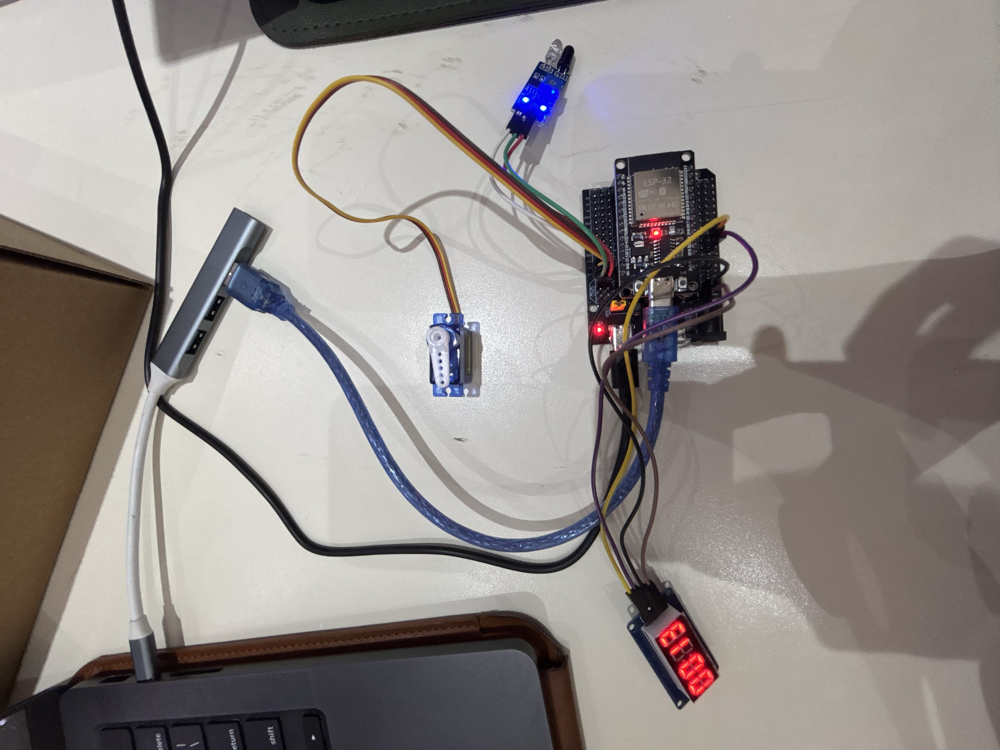
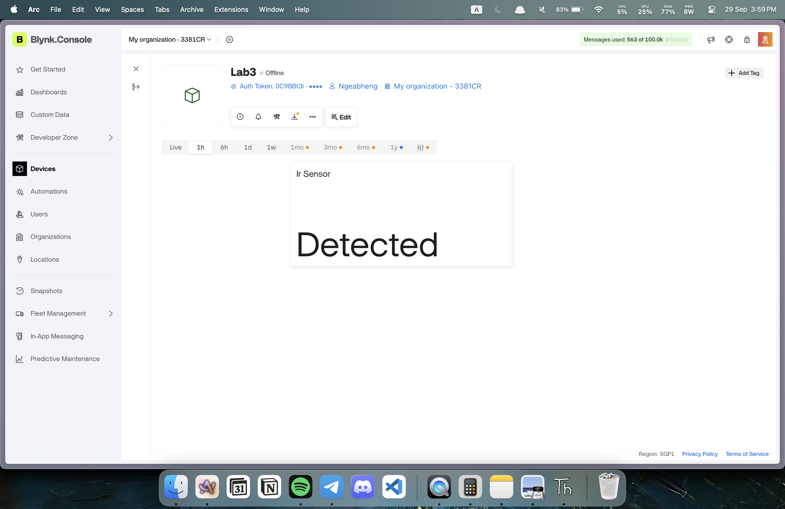

# Lab 3 – IoT Smart Gate Control with Blynk, IR Sensor, Servo Motor, and TM1637

## Group Members

- Andy Eang

- Ngeabheng Chan

- Sereyvattanac Na

## Overview

This lab implements an ESP32-based smart gate system in MicroPython, built around the Blynk cloud platform. An IR obstacle sensor detects approaching objects, an SG90 servo physically drives the gate, and a TM1637 4-digit display shows detection activity locally. The Blynk app mirrors sensor status, exposes a manual slider for the servo, and lets the operator flip between automatic and manual control.

The project ties together sensing, actuation, cloud dashboards, and a local display into a single event-driven control loop.

## Learning Outcomes (CLO Alignment)

- Read an IR sensor and reflect its detection status on Blynk.
- Drive a servo motor from a Blynk slider.
- Trigger automatic gate opening/closing from IR detection events.
- Track detection counts and mirror the value on both TM1637 and Blynk.
- Support both automatic and manual operating modes.
- Document the wiring, dashboard layout, and system behavior.

## Equipment

- ESP32 development board (MicroPython firmware flashed)
- IR obstacle detection sensor
- SG90 servo motor
- TM1637 4-digit 7-segment display
- Breadboard and jumper wires
- USB cable and laptop with Thonny
- Wi-Fi access and a Blynk account (mobile app, iOS/Android)

## Wiring



### Pin Connections

| Component     | ESP32 Pin | Description                        |
| -------------- | --------- | ------------------------------------ |
| IR Sensor VCC | 5V        | Power supply for IR sensor         |
| IR Sensor GND | GND       | Ground                             |
| IR Sensor OUT | GPIO12    | Digital output (LOW when detected) |
| Servo Signal  | GPIO13    | PWM control signal (yellow wire)   |
| Servo VCC     | 5V        | Power supply for servo (red wire)  |
| Servo GND     | GND       | Ground (brown wire)                |
| TM1637 VCC    | 5V        | Power supply for display           |
| TM1637 GND    | GND       | Ground                             |
| TM1637 CLK    | GPIO17    | Clock signal                       |
| TM1637 DIO    | GPIO16    | Data I/O signal                    |

## Configuration

Settings needed to run every task in this lab:

```python
# Blynk Configuration
BLYNK_TOKEN = "YOUR_BLYNK_AUTH_TOKEN"
BLYNK_API = "http://blynk.cloud/external/api"

# Wi-Fi Configuration
WIFI_SSID = "YOUR_SSID"
WIFI_PASS = "YOUR_PASSWORD"

# Pin Configuration
IR_PIN = 12
SERVO_PIN = 13
TM_CLK = 17
TM_DIO = 16

# Servo Configuration
SERVO_CLOSED = 0    # Closed position (degrees)
SERVO_OPEN = 90     # Open position (degrees)
AUTO_DELAY = 1      # Time to hold the gate open (seconds)
```

## Setup Instructions

### 1. Blynk Setup

1. Install the Blynk app (App Store or Google Play) and sign in or create an account.
2. Create a new project:
   - Project name: "Smart Gate Control"
   - Device: ESP32
   - Connection type: Wi-Fi
3. Copy the **Auth Token** emailed to you.
4. Add these widgets to the dashboard:
   - **Label** (V0) – IR sensor status ("Detected" / "Not Detected")
   - **Slider** (V1) – Manual servo control (0–180°)
   - **Value Display** (V2) – Detection counter
   - **Switch** (V3) – Automatic / Manual mode toggle

### 2. ESP32 Setup

1. Flash MicroPython onto the ESP32 (if not already done).
2. Wire the components per the diagram above.
3. Grab the display driver: `tm1637.py` ([GitHub](https://github.com/mcauser/micropython-tm1637)).
4. Fill in your credentials in `Lab3_Main.py`:
   ```python
   BLYNK_TOKEN = "YourAuthTokenFromEmail"
   WIFI_SSID = "YOUR_WIFI_SSID"
   WIFI_PASS = "YOUR_WIFI_PASSWORD"
   ```
5. Upload `Lab3_Main.py` and `tm1637.py` to the ESP32 via Thonny.
6. Reset the board (or run the script) and watch the serial monitor for the connection status.
7. Open Blynk and confirm the device comes online.

## Usage

### Blynk Dashboard

**Monitoring**
- **IR Status (V0)** – flips between "Detected" and "Not Detected" in real time.
- **Detection Counter (V2)** – running total of detection events, mirrored from the TM1637.

**Controls**
- **Servo Slider (V1)** – 0°–180°, only takes effect while manual mode is active.
- **Mode Switch (V3)** – OFF = automatic (IR drives the gate), ON = manual (slider drives the gate, IR ignored).

### Local Display (TM1637)

- Shows the running detection count, zero-padded (e.g. `0042`).
- Brightness is adjustable in code (0–7).

### System Behavior

**Automatic mode (default)**
1. IR sensor is polled continuously.
2. On a new detection:
   - Servo swings to `SERVO_OPEN` (90°).
   - Counter increments; TM1637 and Blynk (V2) both update.
   - IR status label (V0) shows "Detected".
3. After `AUTO_DELAY` seconds, the servo returns to `SERVO_CLOSED` (0°).
4. System is ready for the next detection.

**Manual mode**
1. Operator flips the mode switch (V3) on.
2. IR readings are ignored — no counting, no auto-open.
3. Servo position tracks the slider (V1) directly.
4. TM1637 holds its last counted value.

## Virtual Pin Map

| Virtual Pin | Type   | Direction | Description                                    |
| ----------- | ------ | --------- | ------------------------------------------------ |
| V0          | String | ESP → App | IR status ("Detected" / "Not Detected")         |
| V1          | Slider | App → ESP | Manual servo angle (0–180)                      |
| V2          | Value  | ESP → App | Detection counter                               |
| V3          | Switch | App → ESP | Mode select (0 = automatic, 1 = manual)         |

## Tasks and Checkpoints

### Task 1 — IR Sensor Monitoring 

**Objective:** Read the IR sensor's digital output and reflect its status on Blynk, updating only when the state changes.

**Evidence:** Screenshot of the IR status showing on Blynk.



---

### Task 2 — Blynk-Controlled Servo (15 pts)

**Objective:** Add a 0–180° Blynk slider that drives the servo, with the selected angle shown in the app.


**Evidence:** Short video of the slider driving the servo.

[Task 2 - Servo Control Video](https://youtu.be/yRJPqdlkav8)

---

### Task 3 — Automatic IR Gate Operation (15 pts)

**Objective:** Open the gate automatically on a new IR detection, hold briefly, then close — firing once per new detection rather than repeatedly while the object stays in range.

**Evidence:** Short video of the automatic open/close cycle.

[Task 3 - Automatic Gate Video](https://youtu.be/lWB2sb4-MdY)

---

### Task 4 — TM1637 Detection Counter (15 pts)

**Objective:** Count each new detection event and keep the TM1637 and Blynk's numeric widget in sync.

**Evidence:** Short video showing matching TM1637/Blynk counts.

[Task 4 - TM1637 Display](https://youtu.be/8X-VD4OeShQ)

---

### Task 5 — Complete Smart Gate Integration (20 pts)

**Objective:** Merge Tasks 1–4 into a single program and dashboard, add a Blynk switch (V3) to pick Automatic vs. Manual mode, and keep IR status and the detection counter visible on Blynk at all times.

- **OFF (Automatic):** the IR sensor drives the gate, per Task 3.
- **ON (Manual):** IR input is ignored; the servo follows the Blynk slider (V1) instead, per Task 2.

**Evidence:** Video showing the system working in both modes.

[Task 5 - Manual Override Demo](https://youtube.com/shorts/VPBxF9oA0zo)

---


